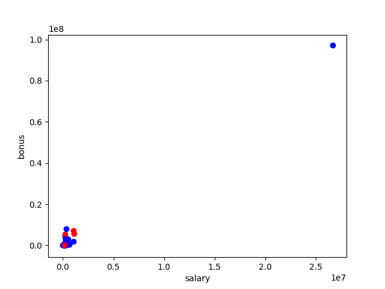
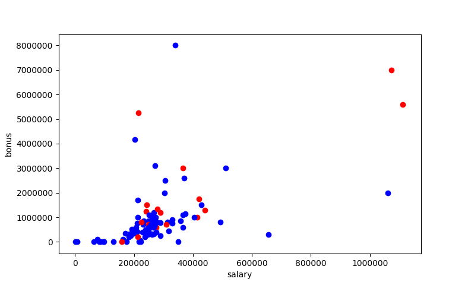

# Identify Fraud in Enron Email

## Overview 

In 2000, Enron was one of the largest companies in the United States. By 2002,
it had collapsed into bankruptcy due to widespread corporate fraud. In the
resulting Federal investigation, a significant amount of typically confidential
information entered into the public record, including tens of thousands of
emails and detailed financial data for top executives.


## Project Goal 
> Summarize for us the goal of this project and how machine
learning is useful in trying to accomplish it. As part of your answer, give some
background on the dataset and how it can be used to answer the project question.
Were there any outliers in the data when you got it, and how did you handle
those?

The goal of this project is to build a identifier for "persons of interest", or
POI, which means individuals who were indicted, reached a settlement or plea
deal with the government, or testified in exchange for prosecution immunity. The
identifier should be based on financial and email data made public as a result
of the Enron scandal.

Machine learning is an excellent tool for classification and making prediction
from data, especially for large data set. In our case, machine learning will be
able to use patterns discovered from the labelled data to infer new
observations.

## Data Exploration 
Our data contains both financial information of Enron employees and emails. 
There are 146 observations and 21 variables (6 email
features, 14 financial features and 1 POI label). 18 employees are labelled as
"POI" and 128 are non-POIs.

### Missing Values

We noted missing Values, 'NaN' while scanning through the data set. The output 
below shows number of missing values by features.

```py                  
salary                          51
to_messages                     60
deferral_payments               107
total_payments                  21
exercised_stock_options         44
bonus                           64
restricted_stock                36
shared_receipt_with_poi         60
restricted_stock_deferred       128
total_stock_value               20
expenses                        51
loan_advances                   142
from_messages                   60
other                           53
from_this_person_to_poi         60
poi                             0
director_fees                   129
deferred_income                 97
long_term_incentive             80
email_address                   35
from_poi_to_this_person         60
```
Apart from variable, "poi", all other features have "NaN" values. Apart from 
`email_address` which contains all strings, they are replaced with value zero.


### Outliers

A basic plot between `salary` and `bonus` was created to help us understand the
data. Colour red represents POI and blue represents non-POI




The observation at top right corner has significantly larger salary and bonus 
than any other employees. We identified that this is `TOTAL` which is a summary 
of all the employees. Hence it will be removed from the dataset. 


Additionally, while looking at document `enron61702insiderpay.pdf`, we noted
that one  observation named `THE TRAVEL AGENCY IN THE PARK`. This is not
considered to be an employee/person in relation to Enron. We will remove this
observation from  our analysis.

Furthermore, employee `LOCKHART EUGENE E` does not have any data, hence will be 
removed from our analysis.

After removing the outliers, the distribution of observations are relatively more
concentrated than before. (See Below)




## Feature Selection

>What features did you end up using in your POI identifier, and what selection
process did you use to pick them? Did you have to do any scaling? Why or why
not? 


### Create New Feature

The data contains number of emails to/from POI. It will be interesting to find 
out whether the proportion of interaction with POI will play an role in our 
model. This might also be able to increase the effectiveness of a few features 
such as `from_messages` and `to_messages`.

The new feature, `poi_email_ratio`, is the total number of POI email interaction 
as a proportion of total email sent and received by an employee.

### Intelligently Select Features

There are 20 features can be used and not all of them are useful in predicting
POI. The next step is to select the features that convey most information to our
model. This will help reduce noise in the  classification and saving processing
time.

We chose to use `SelectKBest` algorithm from Scikit-learn using `f_classif` as
scoring function.  The `f_classif` method computes the ANOVA F-value between labels and
features for classification tasks. A higher score means the feature is more
influential.

We picked 15 features to be included in our model. (14 features from the
original data plus the newly created feature, `poi_email_ratio`).

The scoring from `SelectKBest` can be found below:
```py

 [('exercised_stock_options', 24.815), 
  ('total_stock_value', 24.182), 
  ('bonus', 20.792), 
  ('salary', 18.289), 
  ('deferred_income', 11.458), 
  ('long_term_incentive', 9.9221), 
  ('restricted_stock', 9.212), 
  ('total_payments', 8.772), 
  ('shared_receipt_with_poi', 8.589), 
  ('loan_advances', 7.184), 
  ('expenses', 6.094), 
  ('from_poi_to_this_person', 5.243)
  ('other', 4.187), 
  ('poi_email_ratio', 4.161), 
  ('from_this_person_to_poi', 2.382)]

```

### Feature Scaling

The scale for different features can be significantly different across different
features. The `salary` and `bonus` have a range between hundreds to millions.
However, the maximum value for `from_this_person_to_poi` is only around 500. In
order to bring different features to a more comparable level, we will use
`MinMaxScaler()` from sklearn to scale all features.

In particular, this is necessary for the SVM classifier, which we use in the
following section.

## Pick the Algorithm 

> What algorithm did you end up using? What other one(s) did you try? How did 
model performance differ between algorithms?

Three algorithms were picked initially:
 - Gaussian Naïve-Bayes 
 - Support Vector Machines (SVM)
 - Decision Tree Classifier

GaussianNB is the final selection. Although GaussianNB did not offer the highest
accuracy, it has scored higher in precision, recall and F1 score. SVM did not
perform very well. The accuracy score is similar to other two models, but scored
relatively low across other metrics. Similarly, Decision Tree Classifier did not
score as high as GaussianNB for precision, recall and F1 score.

We tested each algorithm across a number of different parameters, to find an
approximate best algorithm before fine tuning.


## Tune the Algorithm

> What does it mean to tune the parameters of an algorithm, and what can happen 
if you don’t do this well?  How did you tune the parameters of your particular
algorithm? What parameters did you tune?

In the following, we assess each classifier by averaging each of the
measures over multiple trials, for randomly chosen training/test data splits.

**Gaussian**:
There is only one parameter `prior` within GaussianNB model which is not 
relevant in our case, hence no tuning is performed for this model.

The result for Gaussian is shown below:

| Classifier        | Accuracy | Precision | Recall  | F1 Score|
| ------------------| --------:| --------: | -------:|--------:|
| GaussianNB        |   0.7996 |    0.3106 |  0.3226 |   0.2766|


We tuned the following parameters systematically of the SVM and Decision Tree
Classifiers:

**SVM**: `C`, which controls trade-off between smooth decision boundary and 
classifying training points correctly.

**Decision Tree Classifier**: `min_samples_split`, the minimum number of samples 
required to split an internal node.

Here are the results for **SVM** given different values of `C`:

| C parameter     | Accuracy | Precision | Recall  | F1 Score|
| ----------------| --------:| --------: | -------:|--------:|
| 1               |   0.8727 |    0.0000 |  0.0000 |   0.0000|
| 10              |   0.8691 |    0.0763 |  0.0289 |   0.0392|
| 100             |   0.8689 |    0.2975 |  0.1133 |   0.1513|
| 1000            |   0.8443 |    0.1658 |  0.0841 |   0.1001|
| 10000           |   0.7859 |    0.1325 |  0.1185 |   0.1116|

As we can see from the table, when C equals to 100, the model gives a relatively
high accuracy. Although the precision score is the highest among all other C
values, the recall and F1 score are very low.


The results for **Decision Tree Classifier** are as follows:

|min_samples_split| Accuracy | Precision | Recall  | F1 Score|
| ----------------| --------:| --------: | -------:|--------:|
| 2               |   0.7988 |    0.2428 |  0.2436 |   0.2199|
| 5               |   0.8122 |    0.2557 |  0.2502 |   0.2268|
| 8               |   0.8108 |    0.2470 |  0.2366 |   0.2163|
| 10              |   0.8196 |    0.2423 |  0.2208 |   0.2056|
| 15              |   0.8117 |    0.2318 |  0.2042 |   0.1861|

The accuracy of Decision Tree Classifier is lower than SVM in general. Other
metrics perform more stable than SVM. However, the scores for precision, recall
and F1 are still not as high as GaussianNB.


## Validation

> What is validation, and what’s a classic mistake you can make if you do it 
wrong? How did you validate your analysis?

Validation consists of steps to evaluate a model and ensure the algorithm
generalises well. A classic mistake is overfitting, where the results are overly
optimistic for one data set or training data but performs poorly on unseen data
or test data.

We used `train_test_split` package from sklearn to validate our models. In
section 'Validation and Evaluation' within `enron_other_script.py`, we took the
average precision, recall and F1 scores over 300 randomized trials within the
dataset sub-sectioned with a 3:1 ratio. 


## Evaluation

> Give at least 2 evaluation metrics and your average performance for each of
them.  Explain an interpretation of your metrics that says something 
human-understandable about your algorithm’s performance.

There are three main evaluation metrics utilised:

- **Precision** captures the ratio of correct classifications over all
observations with a given predicted label. In other words, it describes how
often the classified POIs are true POIs.

- **Recall** is the ratio of true positive over all observations that are truly
of a given class. In our case, it is the ratio of observations correctly 
labelled POI over all true POIs

- **F1 Score** is a measure of a test's accuracy. It considers both the
precision and the recall using the following formula: 
F1 = 2 * (precision * recall) / (precision + recall)

Accuracy shows the ratio between correct classifications and the total number of
predicted labels. In our model, it is not considered as a good metric. This is
because the POI and non-POI distribution is not even in the data set. A model
that predicts purely non-POIs, will give an accuracy score of 87.6% but it does
not mean much.

All evaluation metrics are included in the section, 'Tune the Algorithm'. The
final algorithm gives the following result:

| Classifier        | Accuracy | Precision | Recall  | F1 Score|
| ------------------| --------:| --------: | -------:|--------:|
| GaussianNB        |   0.7996 |    0.3106 |  0.3226 |   0.2766|
